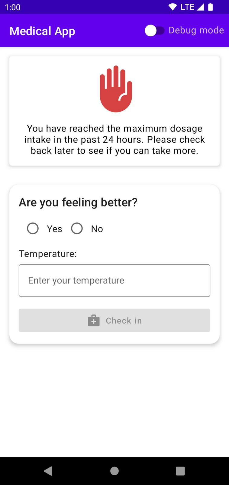

# Medical App

| Check in                               | Dosage suggestion                      | Dosage recorded                        |
|----------------------------------------|----------------------------------------|----------------------------------------|
|  |  |  |

| Remaining time until next intake       | Stop treatment (feeling better)        | Stop treatment (low temperature)       |
|----------------------------------------|----------------------------------------|----------------------------------------|
|  |  |  |

| Maximum dosage reached                 | Seek medical help                      | Debug menu                             |
|----------------------------------------|----------------------------------------|----------------------------------------|
|  |  |  |

# Assumptions
The specification mentions the following age ranges:

> a. Children aged 10-11: 500mg

> b. Children aged 11-12: 625mg

> c. Adults (16+): Take between 500-1000mg

There are overlapping age ranges, and there are also some ranges that are missing. As a result, I  have implemented the dosage as follows:

| Age          | Dosage               |
|--------------|----------------------|
| 9 or younger | age is not supported |
| 10           | 500mg                |
| 11           | 500mg                |
| 12           | 625mg                |
| 13           | age is not supported |
| 14           | age is not supported |
| 15           | age is not supported |
| 16 or older  | 500-1000mg           |

# Debug menu
There is a debug menu that facilitates testing. It can be enabled by toggling the "Debug mode" switch on the app bar. With this feature, the following actions can be performed:
* Advancing the time
* Changing the patient's age
* Viewing the dosage intake history

# Future Improvements
Potential future improvements include, but are not limited to:
* Persisting the state and collected data.
* Moving the medical protocol to the server because it can change over time, and up-to-date versions cannot be guaranteed on the client.
* Saving the check-in data and drawing a diagram over time to track temperature changes.
* Protecting patient data by requiring a PIN code at startup and storing the collected data encrypted.
* Enabling a Dark mode option.
* Optimising for different screen sizes.
* Creating UI tests, integration tests, and end-to-end tests.
* Implementing a multi-module architecture, separating each feature into its own module for better modularity and maintainability.
* Incorporating static code analysis tools like detekt and ktlint to enforce code style guidelines, identify potential bugs, and ensure consistent code quality throughout the project.
* Implementing robust error logging and analytics frameworks, such as Crashlytics or Firebase Analytics, to gain insights into app crashes and user behavior.
* Integrating a continuous integration and delivery (CI/CD) pipeline to automate build, testing, and deployment processes.
* Applying code obfuscation and minification techniques, like ProGuard or R8, to protect sensitive information and reduce app size.
* Implementing a modularised UI component library to promote consistency in the app's user interface and facilitate reusability.
* Extracting styles and colors in Jetpack Compose would enhance the codebase by segregating these elements.
* Utilising performance profiling tools like Android Profiler or LeakCanary to identify and resolve memory leaks and performance bottlenecks.
* It would be beneficial to extract version numbers from dependencies, and dependency locking could also be advantageous. Without dependency locking, changing a library version could introduce additional dependencies, potentially making the app unreliable. This would require extensive testing to ensure stability.

# Time Constraint
I spent slightly less than two working days on this task.
